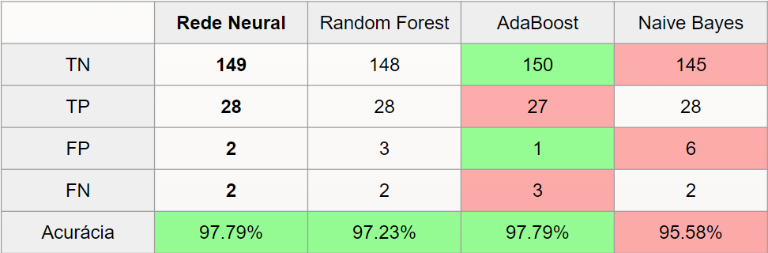

# Sobre
Códigos e datasets desenvolvidos para simulação e estudos de fluxos na rede.

Foram utilizados o Mininet Wifi para definição da topologia de rede, simulação dos tráfegos e geração dos dataeets, além do Google Colaboratory para processamento dos dados e aplicação do Aprendizado de Máquina.

O objetivo deste estudo é analisar o uso de estruturas probabilísticas para armazenar informações osbre o tráfego de uma rede e posteriormente utilizá-las para detecção de anomalias.

As estruturas probabilísticas fazem uso da um indexação probabilística (em detrimento das convencionais, que são determinísticas) baseada em hashing, com intuito de reduzir o espaço em memória e a complexidade dos dados representados. 

O tipo de estrutura probabilística utilizado neste experimento é o Counter-Min, consistindo de uma matriz cujas posições são incrementadas a cada retorno de um hash. O hash é aplicado aos elementos de um fluxo de dados obtidos em um intervalo de tempo.

# Experimento

#### Objetivo
Simular a detecção de anomalias no fluxo de informações com auxílio de Estruturas Probabilísticas e Aprendizado de Máquina, a partir de simulações utilizando o MiniNet Wifi.

#### Metodologia:
- Desenvolver a topologia de rede no Mininet Wifi;
- Similar tráfegos normalidade entre os dispositivos;
- Adicionar anomalias ao tráfego;
- Capturar os pacotes da rede;
- Gerar as estruturas probabilísticas;
- Extrair métricas probabilísticas;
- Aplicar Aprendizado de Máquina às métrica para identificar intervalos de tempo.

#### Desenvolvimento
Foram gerados datasets de 15 min (900 seg) de duração total, contendo 30 fluxos anômalos e 150 fluxos normais, com 5 segundos de duração cada. Aos dados obtidos foram aplicados as estruturas probabilísticas, extraído as métricas e aplicado o algorítmo de aprendizagem.

##### Para classificação, foram utilizados os seguintes datasets:
- 10 min para treino;
- 5 min para validação;
- 15 min para teste.

#### Resultado dos algorítmos

# Mininet Wifi
Simula uma troca de dados com diferentes fluxos coletando e armazenando informações dos pacotes de cada um dos switchs em um respectivo PCAP.

#### Topologia:

|--- [SW1] --- [AP1] --- [STA1]  
|--- [SW2] --- [AP2] --- [STA2]  
|--- [SW3] --- [AP3] --- [STA3]  
|--- [SW4] --- [AP4] --- [STA4]  
|  
|-- [SW5]  

#### Requisitos:
  - Mininet Wifi
  - Hping3
  - tcpdump

Para a geração dos Fluxos de dados execute o main.py com as seguintes flags:
  - -f : para definir e gerar os fluxos;
  - -p : para plotar a topologia de rede utilizada;
  - -m : para ativar a mobilidade das estações no espaço coberto pela rede.

### Configurações

#### Parâmetros de entrada (-f)
- Tempo T de execução (em segundos);
- Número M de mice flows;
- Número N de elephant flows;

O script dividira o periodo de tempo T em N+M intervalos iguais e iniciara os fluxos, com T/N+M segundos cada, aleatoriamente, informando em quais intervalos foram iniciados os fluxos elefante.

#### intervalos de mice flows:
- são iniciados 2 a 8 fluxos simultâneos;
- tamanho dos pacotes: 20 a 500 bytes;
- portas definidas aleatoriamente entre 1025 e 65536.

#### elephant flows:
- são iniciados em paralelo aos mice flows;
- tamanho dos pacotes: 500-1400 bytes;
- portas definidas aleatoriamente entre: 1025 e 65536.

# Google Colab
Implementa as estruturas probabilísticas, extrai as mátricas e aplica aos técnicas de aprendizado de máquina.

#### Estrutura Probabilística:
- Tamanho do contador: 1000 posições;
- Entrada do hash: IP de Origem, IP de Destino, Porta de Origem, Porta de Destino;
- Função de Hash: MurmurHash3 32-bits + split na posição 3 (ie: resultando em um inteiro de 0 a 999);
- Dado armazenado: Tamanho do pacote;
- Idade de cada contador: 5 segundos.

#### Métricas Extraídas das Estruturas:
- média;
- mediana;
- índice do maior valor;
- maior valor;
- soma dos elementos;
- número de não-zeros;
- desvio padrão (σ);
- n° de elementos 2x maiores que σ;
- n° de elementos 3x maiores que σ.

#### Métodos utilizados para classificação doa dados:
- Rede Neural;
- Random Forest;
- AdaBoost;
- Naive Bayes.
